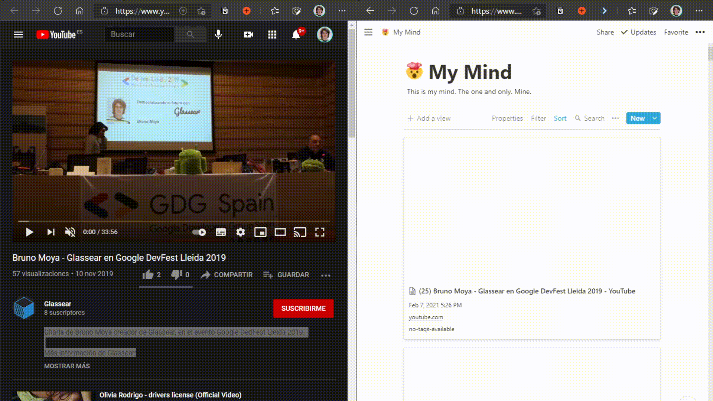
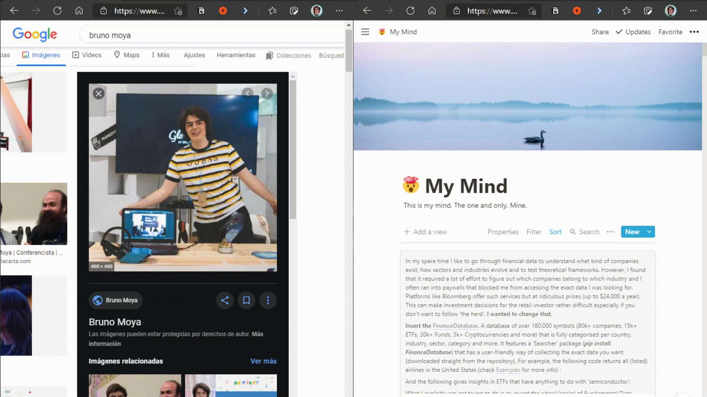
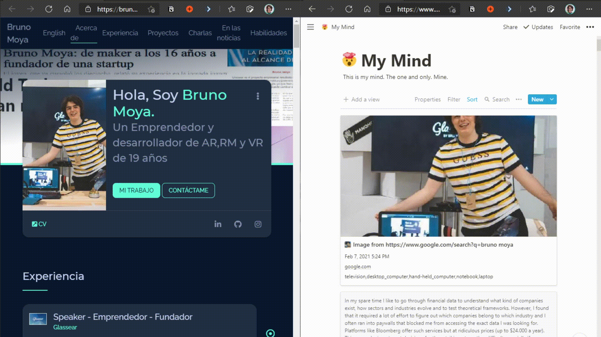

<!-- PROJECT LOGO -->
 

  

  <h3 align="center">NotionAI MyMind</h3>

  

    This repo uses AI and the wonderful Notion to enable you to add anything on the web to your "Mind" and forget about everything else.
     
    <a href="https://github.com/elblogbruno/NotionAI-MyMind/wiki"><strong>Explore the docs »</strong></a>
     
     
    <a href="https://www.notion.so/glassear/My-Mind-Demo-Structure-ebd913d0cfa14889b122d391a883db94">View Demo</a>
    ·
    <a href="https://github.com/elblogbruno/NotionAI-MyMind/issues">Report Bug</a>
    ·
    <a href="https://github.com/elblogbruno/NotionAI-MyMind/issues">Request Feature</a>
  

### Add content 
<a href="https://github.com/elblogbruno/NotionAI-MyMind/wiki/Notion-AI-My-Mind-Collections"><strong>This is collections example, where you can have different collections or databases of contents, fully customizable on notion. »</strong></a>

### Search
<a href="https://www.notion.so/Intro-to-databases-fd8cd2d212f74c50954c11086d85997e"><strong>This is a fully customizable and searchable database in Notion. »</strong></a>

 
# Free your mind!

<!-- TABLE OF CONTENTS -->

  
Table of Contents

  <ol>
    <li>
      <a href="#project-philosophy">Project Philosophy</a>
      <ul>
        <li><a href="#examples-of-what-you-can-do">Examples</a></li>
        <li><a href="#extensions">Mind Extensions</a></li>
      </ul>
    </li>
    <li>
      <a href="#installing">Installing</a>
      <ul>
        <li><a href="#i-have-installed-the-server-what-to-do-next">I have installed the server, what to do next?</a></li>
        <li><a href="#docker-compose">Docker-Compose</a></li>
       </ul>
      </ul>
    </li>
    <li><a href="#common-issues">Common Issues</a></li>
    <li><a href="#roadmap">Roadmap</a></li>
  </ol>

## Project Philosophy.

The idea is to have extensions for your mind on the browser, and app on android and Ios, allowing you to add whatever you find on the web in your "Mind". Also, adding image and article tagging capabilities thanks to AI, so you can simply search on your "Mind" for what you remember.

Right now, there's a working Python Local Server, that receives all the data from the extension and the app, and publishes it to your fully customizable and searchable database in Notion. So it is 100% open source and fully private!

## Examples of what you can do.

Add text to your mind  |  Add images to your mind
:---: | :---:
  |  

Add websites to your mind |  Search on your mind
:---: | :---:
  |  

### Extensions
### Chromium users
https://chrome.google.com/webstore/detail/notion-ai-my-mind/eaheecglpekjjlegffodbfhbhdmnjaph?hl=es&authuser=0 the chromium browsers such as google chrome or microsoft edge can install the extension from the store!
### Firefox users
https://addons.mozilla.org/en-US/firefox/addon/notion-ai-my-mind/ firefox users can install the extension from the store!
### Android and Ios users

Users can install the android app from android store
https://play.google.com/store/apps/details?id=com.elblogbruno.notion_ai_my_mind

I won't be releasing the app on the Apple App Store, as I don't have an Apple Developer Account either Mac OS based computer.
Meanwhile, you can clone the flutter project and build the app yourself.

# Installing

- You can check it out on the wiki: [Installing the Notion AI My Mind Server](https://github.com/elblogbruno/NotionAI-MyMind/wiki/Installing-the-Notion-AI-My-Mind-Server)

- This covers:
    - Notion AI My Mind Server installation

### I have installed the server, what to do next?

- You can check it out on the wiki: [I have installed the server, what to do next?](https://github.com/elblogbruno/NotionAI-MyMind/wiki/I-have-installed-the-server,-what-to-do-next%3F)

- This covers:
    - Notion database creation
    - Browser or app walktrough with explanations.

### Docker-Compose

- You can check it out on the wiki: [Installing the Notion AI My Mind Server on Docker](https://github.com/elblogbruno/NotionAI-MyMind/wiki/Installing-the-Notion-AI-My-Mind-Server-on-Docker)

- This covers:
    - Server installation as a Docker Image

## Common Issues

- You can check it out on the wiki: [Common Issues](https://github.com/elblogbruno/NotionAI-MyMind/wiki/Common-Issues)

## Roadmap
- You can check the roadmap here: https://github.com/elblogbruno/NotionAI-MyMind/projects/1
