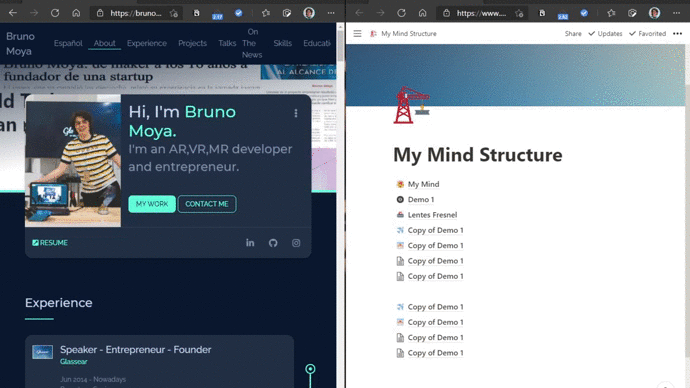

<!-- PROJECT LOGO -->
 

  
  

  
  <h3 align="center">NotionAI MyMind</h3>
  
  

    This repo uses AI and the wonderful Notion to enable you to add anything on the web to your "Mind" and forget about everything else.
     
    <a href="https://github.com/elblogbruno/NotionAI-MyMind/wiki"><strong>Explore the docs »</strong></a>
     
     
    <a href="https://www.notion.so/glassear/My-Mind-Demo-Structure-ebd913d0cfa14889b122d391a883db94">View Demo</a>
    ·
    <a href="https://github.com/elblogbruno/NotionAI-MyMind/issues">Report Bug</a>
    ·
    <a href="https://github.com/elblogbruno/NotionAI-MyMind/discussions/categories/ideas">Request Feature</a>
  

  

     
  
  

  

### Add content 
<a href="https://github.com/elblogbruno/NotionAI-MyMind/wiki/Notion-AI-My-Mind-Collections"><strong>This is collections example, where you can have different collections or databases of contents, fully customizable on notion. »</strong></a>

### Search
<a href="https://www.notion.so/Intro-to-databases-fd8cd2d212f74c50954c11086d85997e"><strong>This is a fully customizable and searchable database in Notion. »</strong></a>

 
# Free your mind!

<!-- TABLE OF CONTENTS -->

  
Table of Contents

  <ol>
    <li>
      <a href="#project-philosophy">Project Philosophy</a>
      <ul>
        <li><a href="#examples-of-what-you-can-do">Examples</a></li>
        <li><a href="#extensions">Mind Extensions</a></li>
        <li><a href="#multilanguage-support-and-translation-collaboration">Translation into your language</a></li>
      </ul>
    </li>
    <li>
      <a href="#installing">Installing</a>
      <ul>
        <li><a href="#i-have-installed-the-server-what-to-do-next">I have installed the server, what to do next?</a></li>
        <li><a href="#docker-compose">Docker-Compose</a></li>
       </ul>
      </ul>
    </li>
    <li><a href="#common-issues">Common Issues</a></li>
    <li><a href="#roadmap">Roadmap</a></li>
  </ol>

## Project Philosophy.

The idea is to have extensions for your mind on the browser, and app on android and Ios, allowing you to add whatever you find on the web in your "Mind". Also, adding image and article tagging capabilities thanks to AI, so you can simply search on your "Mind" for what you remember.

Right now, there's a working Python Local Server, that receives all the data from the extension and the app, and publishes it to your fully customizable and searchable database in Notion. So it is 100% open source and fully private!

Maybe we can say it is an Open Source Alternative to [Raindrop](https://raindrop.io/) and [Microsoft Edge Collections](https://support.microsoft.com/en-us/microsoft-edge/organize-your-ideas-with-collections-in-microsoft-edge-60fd7bba-6cfd-00b9-3787-b197231b507e), but much cooler with Community driven opinion and AI Capabilities, and a repo maintainer with lot of imagination (yes my brain goes at 150% speed)!

## Examples of what you can do.

Add text to your mind  |  Add images to your mind
:---: | :---:
  |  

Add websites to your mind |  Search on your mind
:---: | :---:
  |  

### Extensions

[mymind](https://mymind.com/) company, friendly asked me to remove the browser extension as it infringes its copyright. Until further re-design of the browser extension, extension will not be available for download on the Chrome Web Store and Firefox Addon Store.

### Android and Ios users

Users can install the android app from android store. On Ios you can clone the flutter project and build the app.

I won't be releasing the app on the Apple App Store, as I don't have an Apple Developer Account either Mac OS based computer.
Meanwhile, you can clone the flutter project and build the app yourself.

## Multilanguage Support and Translation Collaboration

Since version 2.0.4 NotionAI-MyMind has multilanguage support! Now server, phone app and extension is translated to English and Spanish! 
Would you like to have it translated into your own language? 

You can have more info on how to collaborate it helps out people from all comunities and languages access this amazing tool! 
More info here:

https://github.com/elblogbruno/NotionAI-MyMind-Translations

## Installation Tutorial

# Installing
- It is very easy, and there are different ways from click to install one's to more advanced ones, in case you want to install it from source.

- You can check it out on the wiki: [Installing the Notion AI My Mind Server](https://github.com/elblogbruno/NotionAI-MyMind/wiki/Installing-the-Notion-AI-My-Mind-Server)

- This covers:
    - Notion AI My Mind Server installation. 

### I have installed the server, what to do next?
- If you don't enter the Notion credentials either create the notion page, you would be not having fun with it!

- You can check it out on the wiki: [I have installed the server, what to do next?](https://github.com/elblogbruno/NotionAI-MyMind/wiki/I-have-installed-the-server,-what-to-do-next%3F)

- This covers:
    - Notion database creation
    - Browser or app walktrough with explanations.

- You can watch the video also on how to create the structure!
 

### Docker-Compose

- You can check it out on the wiki: [Installing the Notion AI My Mind Server on Docker](https://github.com/elblogbruno/NotionAI-MyMind/wiki/Installing-the-Notion-AI-My-Mind-Server-on-Docker)

- This covers:
    - Server installation as a Docker Image

## Common Issues

- You can check it out on the wiki: [Common Issues](https://github.com/elblogbruno/NotionAI-MyMind/wiki/Common-Issues)

## Roadmap
- You can check the roadmap here: https://github.com/elblogbruno/NotionAI-MyMind/projects/1
